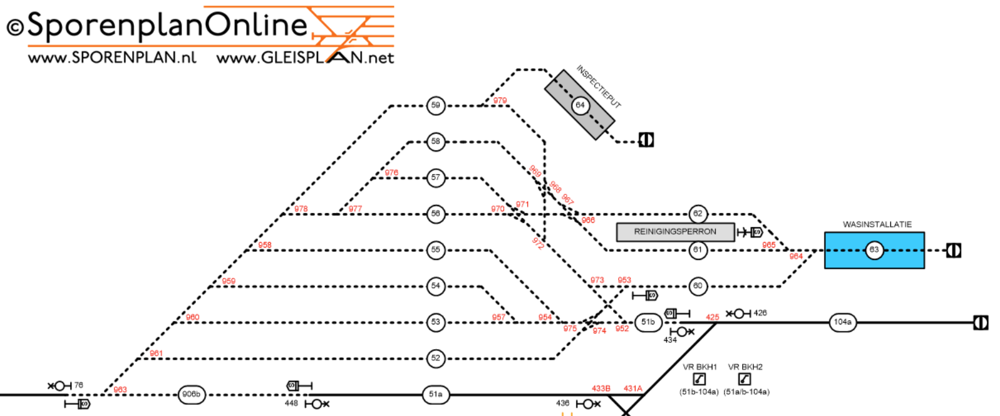

# Locations

This folder includes JSON formatted location files, in the TORS and HIP formats. Below, we visualize the layouts and explain the structure.

## Structure
Each file contains trackparts, which can be either 
- a `RailRoad`: regular track part with a given length
- a `Switch`: this is a switch which has two tracks connected on one side and one track on the other side
- an `EnglishSwitch`: this is a switch connecting two tracks on both sides of the switch
- an `Intersection`: this is a different kind of switch also connecting two tracks on both sides of the switch
- a `Bumper`: this is the end of a track, each `RailRoad` track must always have exactly one track part on both the A and B sides, and for dead-end tracks this is often a `Bumper`, as well as for incoming tracks.

## Kleine Binckhorst
This is a shunting yard near The Hague Central station in the Netherlands, its layout is visualized in Figure 1 (source: [SporenPlan online](https://sporenplan.nl/))

### Details:
The incoming (gateway) track is RailRoad 906a (left bottom corner) which connects to a bumper (`Stootblok906a`) and a switch (`Wissel963`, which is also indicated as 963 in Figure 1.). This switch connects to RailRoad 906b, but in our location it is not connected to track 51a, and instead ends with a bumper (`Sein70`).